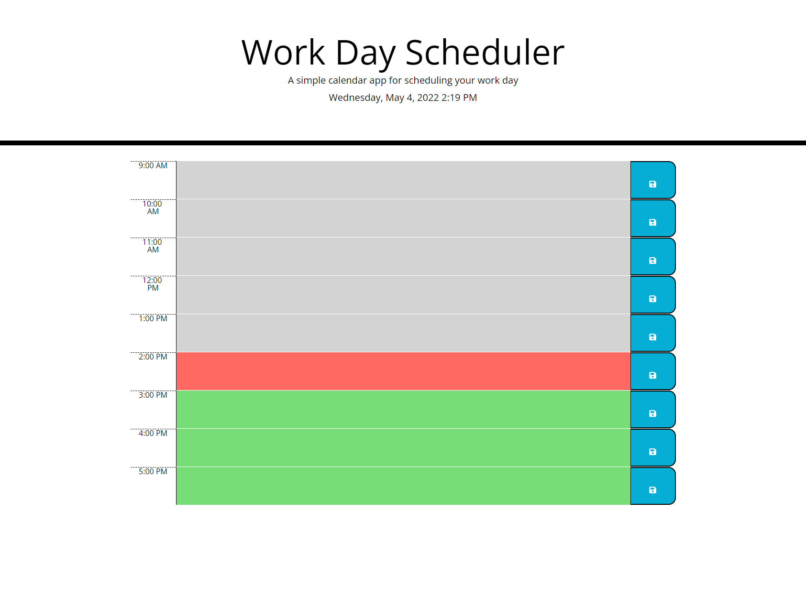

# Work Day Scheduler

## Description
This project is a daily planner. The user can save tasks to do in each time block. The user inputs are saved in localStorage.
As time passes, the time blocks change color: green for future, red for present, and grey for past.

## Link to deployed application:
https://kmascott.github.io/work-day-scheduler/

## Screenshot

